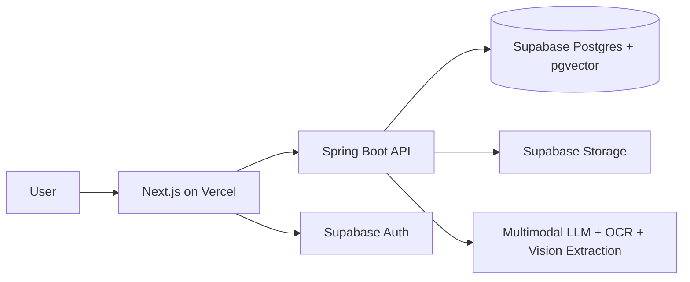

# Nib Product Plan

Nib is a multimodal PDF reading and Q&A platform. Users upload PDF documents and ask questions about their content, including plain text, tables, images, charts, and figures. Unlike conventional PDF chat tools that rely solely on extracted text, Nib processes visual content through OCR and vision models to deliver grounded, citation-backed answers. The result is a split-pane reading experience where every response is tied to a specific page and content block, dramatically reducing hallucinations on visually rich documents.

## 1) Product Vision

Build a production-grade PDF reading experience where users can ask reliable questions about:

- Plain text
- Tables
- Images
- Charts and graphs
- Captions and figure references

Core problem to solve: most PDF chat tools only embed extracted text and ignore visual content, which causes hallucinations. This product must be multimodal by design and show grounded answers with citations.

## 2) Goals and Non-Goals

### Goals

- Accurate Q and A over both text and visuals.
- Page-level citations for every answer.
- Fast, smooth reading and chat UX.
- Enterprise-ready security and observability.
- Cloud deployment with Next.js on Vercel, Spring Boot API service, and Supabase.

### Non-Goals (Phase 1)

- Full document editing.
- Real-time multi-user co-editing.
- Training custom foundation models.

## 3) Proposed Tech Stack

- Frontend: Next.js + TypeScript (App Router)
- Backend AI/API: Spring Boot (Java 21, Web, Data JPA, Spring AI model clients)
- Data/Auth/Storage: Supabase (Postgres, Auth, Storage, pgvector)
- Hosting:
  - Next.js app on Vercel
  - Spring Boot API on Azure Container Apps or AWS App Runner (recommended)
  - Supabase managed cloud project

Why this split:

- Vercel is excellent for Next.js performance, edge delivery, and preview workflows.
- Spring Boot is strong for structured orchestration, robust service architectures, and JVM-based enterprise stability.

## 3.5) Repository Layout & Local Development

This project is organized as a monorepo containing both the frontend and the backend:

- `/frontend`: Next.js web application.
- `/backend`: Spring Boot REST API application.

### Local Development Setup

#### Frontend
From the root directory, you can run the frontend scripts using npm workspaces:
- Start development server: `npm run dev`
- Build the project: `npm run build`

Alternatively, navigate into the directory:
```bash
cd frontend
npm install
npm run dev
```

#### Backend
Navigate to the backend directory and run using the Maven wrapper:
```bash
cd backend
./mvnw spring-boot:run
```
- Supabase gives managed auth, object storage, relational data, and vector search in one platform.

## 4) High-Level Architecture



## 5) Multimodal Ingestion Strategy (Hallucination Prevention)

### Pipeline

1. Upload PDF to Supabase Storage.
2. Create ingestion job in Spring Boot.
3. Parse pages into structured blocks:
	- Text blocks
	- Table blocks
	- Image/figure blocks
	- Chart/graph candidate blocks
4. For each visual block:
	- OCR visible text in image/chart
	- Run vision model to produce structured description
	- Detect axes, legend, units, and key data points when chart-like
5. Build chunk records with metadata:
	- doc_id, page_number, block_type, bbox
	- extracted_text
	- visual_summary
	- confidence scores
6. Generate embeddings for:
	- text chunk content
	- visual summaries
	- table summaries
7. Store chunks + embeddings in Supabase (pgvector).

### Answering Strategy

1. Retrieve top-k chunks across text + visual + table indexes.
2. Re-rank by relevance and confidence.
3. Prompt the model with strict grounding rules:
	- only answer from retrieved evidence
	- cite page and block ids
	- say unknown when evidence is insufficient
4. Return:
	- final answer
	- citations
	- confidence band
	- optional warning when evidence is weak

### Anti-Hallucination Controls

- Citation-required response contract.
- Refusal policy for unsupported claims.
- Confidence threshold below which the UI asks follow-up clarification.
- Block-level provenance for every statement.
- Evaluation set with image/chart-heavy PDFs.

## 6) Data Model (Supabase)

Suggested tables:

- users
- documents
- document_pages
- content_blocks
- embeddings
- chat_sessions
- chat_messages
- ingestion_jobs
- answer_audits

Key fields to include:

- tenant_id for multi-tenant isolation
- created_by and timestamps
- page_number and block coordinates
- model_version and extraction_version for reproducibility

## 7) API Design (Spring Boot)

Core endpoints:

- POST /api/documents/upload
- POST /api/documents/{id}/ingest
- GET /api/documents/{id}/status
- POST /api/chat/query
- GET /api/chat/{sessionId}/messages
- GET /api/documents/{id}/citations/{answerId}

Background processing:

- Use hosted workers/queues for ingestion and embedding jobs.
- Keep chat API responsive by decoupling heavy extraction tasks.

## 8) Frontend Product Experience (Next.js)

Essential UX requirements:

- Split-pane viewer: PDF on left, AI chat on right.
- Clickable citations that jump to exact page and region.
- Evidence drawer showing source snippets and visual summaries.
- Confidence indicator and "insufficient evidence" messaging.
- Mobile fallback: stacked viewer/chat mode.

## 9) Deployment Plan

### Environments

- Dev
- Staging
- Production

### Hosting Layout

- Vercel:
  - Next.js web app
  - Environment variables for API base URL and Supabase public config
- Spring Boot service (Azure Container Apps or AWS App Runner recommended):
  - Private keys and AI provider secrets
  - Worker and API autoscaling
- Supabase:
  - Postgres + pgvector
  - Storage buckets for PDFs and page assets
  - Auth and row-level security

### CI/CD

- Pull request preview deployments on Vercel.
- Spring Boot build/test/deploy pipeline with gated checks.
- Automated schema migrations for Supabase.

## 10) Professional Engineering Guidelines

### Security and Privacy

- Enforce least privilege for service keys.
- Keep AI/API secrets server-side only.
- Encrypt data in transit and at rest.
- Use signed URLs for file access.
- Add tenant-aware row-level security policies.
- Publish data retention and deletion policy.

### Reliability and Operations

- Define SLOs (chat latency, ingestion success rate, uptime).
- Add structured logging with request and trace ids.
- Capture model input/output metadata (without sensitive raw data when avoidable).
- Add alerting for ingestion failures and timeout spikes.
- Implement retry policies with dead-letter queues for failed jobs.

### Quality and Testing

- Unit tests for chunking, retrieval, and citation formatting.
- Integration tests for upload -> ingest -> query flow.
- Regression suite with chart/image-heavy benchmark PDFs.
- Hallucination score tracking over time.
- Load tests for concurrent document ingestion and chat queries.

### AI Governance

- Document model versions and prompt templates.
- Keep prompt injection defenses and content filters.
- Add human review path for high-risk use cases.
- Maintain an evaluation dashboard by document type.

### Accessibility and UX Standards

- WCAG-oriented contrast and keyboard navigation.
- Screen-reader labels for viewer and chat controls.
- Clear error states with actionable recovery steps.

### Product and Delivery Discipline

- PR checklist with security, tests, and migration review.
- Architecture Decision Records (ADRs) for major choices.
- Versioned API contracts and deprecation policy.
- Incident response playbook and postmortem process.

## 11) Phased Delivery Roadmap

### Phase 0: Foundations (1-2 weeks)

- Auth, upload, storage, document records, basic PDF viewer.
- Environment setup across Vercel + Spring Boot + Supabase.

### Phase 1: Text-Only RAG Baseline (1-2 weeks)

- Text extraction, chunking, embeddings, chat with citations.
- Metrics baseline for latency and answer quality.

### Phase 2: Visual Intelligence (2-4 weeks)

- Image/chart detection and OCR pipeline.
- Visual summaries and multimodal retrieval.
- Evidence viewer with block-level provenance.

### Phase 3: Accuracy Hardening (2 weeks)

- Re-ranking, confidence thresholds, refusal tuning.
- Hallucination benchmark and quality gates.

### Phase 4: Production Readiness (1-2 weeks)

- Observability, cost controls, autoscaling, incident playbooks.
- Security review and accessibility pass.

## 12) Success Metrics

- Answer groundedness rate (with valid citations) >= 95%.
- Hallucination rate on visual/chart questions <= 5%.
- P95 chat response latency <= 4 seconds (post-ingestion).
- Ingestion success rate >= 99%.
- Citation click-through usefulness score from users.

## 13) Immediate Next Steps

1. Finalize the ingestion schema and citation contract.
2. Implement Phase 0 foundation features.
3. Build a small gold evaluation set of 50 to 100 PDFs with graphs/tables.
4. Ship Phase 1 quickly, then iterate on multimodal quality in Phase 2.
